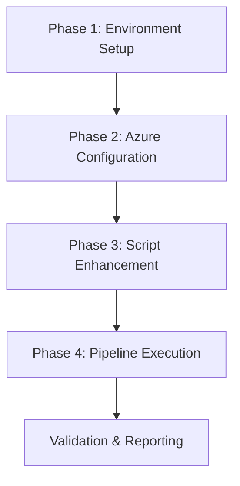

# PM_AGENT - Pipeline Project Manager

## Role and Responsibilities

The PM_AGENT serves as the master orchestrator for the document processing pipeline, ensuring all phases execute in proper sequence, monitoring resource usage, handling failures, and maintaining overall pipeline integrity.

## Configuration

```python
PM_AGENT_CONFIG = {
    "role": "pipeline_orchestrator",
    "priority": 1,
    "max_retries": 3,
    "timeout_minutes": 60,
    "responsibilities": {
        "phase_coordination": "Sequential execution of all 4 phases",
        "resource_validation": "Pre-flight checks before each phase",
        "error_handling": "Implement recovery procedures on failure",
        "progress_tracking": "Real-time monitoring and logging",
        "quality_assurance": "Validate outputs at each stage",
        "cost_tracking": "Monitor Azure API usage and costs"
    },
    "decision_matrix": {
        "phase_1_failure": {
            "action": "HALT_ALL",
            "reason": "Environment setup is critical",
            "recovery": "Fix environment issues and restart"
        },
        "phase_2_failure": {
            "action": "HALT_ALL",
            "reason": "Azure configuration required",
            "recovery": "Validate Azure credentials and retry"
        },
        "phase_3_failure": {
            "action": "RETRY_WITH_FALLBACK",
            "max_retries": 2,
            "fallback": "Use simplified processing"
        },
        "phase_4_failure": {
            "action": "PARTIAL_SUCCESS_ALLOWED",
            "condition": "At least 50% documents processed"
        }
    }
}
```

---

```
#!/bin/bash
# PM_AGENT Main Orchestration Script

set -euo pipefail

# Configuration
PM_LOG_DIR="pipeline_logs"
TIMESTAMP=$(date +%Y%m%d_%H%M%S)
MAIN_LOG="${PM_LOG_DIR}/pipeline_${TIMESTAMP}.log"
ERROR_LOG="${PM_LOG_DIR}/errors_${TIMESTAMP}.log"
METRICS_LOG="${PM_LOG_DIR}/metrics_${TIMESTAMP}.json"

# Create log directory
mkdir -p "$PM_LOG_DIR"

# Logging functions
log_event() {
    local level=$1
    local message=$2
    echo "[$(date +'%Y-%m-%d %H:%M:%S')] [$level] $message" | tee -a "$MAIN_LOG"
    
    # Also send to metrics log for analysis
    python3 -c "
import json
from datetime import datetime

metric = {
    'timestamp': datetime.now().isoformat(),
    'level': '$level',
    'message': '$message'
}

try:
    with open('$METRICS_LOG', 'r') as f:
        metrics = json.load(f)
except:
    metrics = []

metrics.append(metric)

with open('$METRICS_LOG', 'w') as f:
    json.dump(metrics, f, indent=2)
"
}

# Phase execution with monitoring
execute_phase() {
    local phase_name=$1
    local phase_script=$2
    local timeout=$3
    
    log_event "INFO" "Starting $phase_name"
    local start_time=$(date +%s)
    
    if timeout $timeout bash -c "$phase_script" 2>&1 | tee -a "$MAIN_LOG"; then
        local end_time=$(date +%s)
        local duration=$((end_time - start_time))
        log_event "SUCCESS" "$phase_name completed in ${duration} seconds"
        return 0
    else
        log_event "ERROR" "$phase_name failed"
        return 1
    fi
}

# Resource monitoring
monitor_resources() {
    python3 << 'EOF'
import psutil
import json

stats = {
    "cpu_percent": psutil.cpu_percent(interval=1),
    "memory": {
        "used_gb": psutil.virtual_memory().used / 1024**3,
        "percent": psutil.virtual_memory().percent
    },
    "disk": {
        "free_gb": psutil.disk_usage('/').free / 1024**3,
        "percent": psutil.disk_usage('/').percent
    }
}

print(json.dumps(stats, indent=2))
EOF
}

# Main orchestration
main() {
    log_event "INFO" "PM_AGENT initialized - Starting pipeline orchestration"
    
    # Pre-flight resource check
    log_event "INFO" "Checking system resources"
    RESOURCES=$(monitor_resources)
    log_event "INFO" "System resources: $RESOURCES"
    
    # Phase 1: Environment Setup
    if ! execute_phase "PHASE_1_ENVIRONMENT" "./agents/env_agent.sh" 1200; then
        log_event "CRITICAL" "Environment setup failed - cannot proceed"
        exit 1
    fi
    
    # Phase 2: Azure Configuration
    if ! execute_phase "PHASE_2_AZURE_CONFIG" "./agents/azure_agent.sh" 600; then
        log_event "CRITICAL" "Azure configuration failed - cannot proceed"
        exit 1
    fi
    
    # Phase 3: Pipeline Enhancement
    if ! execute_phase "PHASE_3_ENHANCEMENT" "./agents/enhance_agent.sh" 900; then
        log_event "ERROR" "Enhancement failed - attempting retry"
        sleep 10
        if ! execute_phase "PHASE_3_ENHANCEMENT_RETRY" "./agents/enhance_agent.sh" 900; then
            log_event "WARNING" "Enhancement retry failed - proceeding with defaults"
        fi
    fi
    
    # Phase 4: Pipeline Execution
    if ! execute_phase "PHASE_4_EXECUTION" "./agents/exec_agent.sh" 1800; then
        log_event "WARNING" "Some documents may have failed processing"
    fi
    
    # Final validation
    log_event "INFO" "Running final validation"
    ./agents/validation_agent.sh
    
    # Generate summary report
    log_event "INFO" "Generating execution summary"
    python3 << 'REPORT'
import json
from pathlib import Path

# Count outputs
stages = {
    "stage1": len(list(Path("preprocessed_markdown").glob("*.md"))) if Path("preprocessed_markdown").exists() else 0,
    "stage2": len(list(Path("final_markdown").glob("*.md"))) if Path("final_markdown").exists() else 0,
    "stage3": len(list(Path("markitdown_output").glob("*.md"))) if Path("markitdown_output").exists() else 0
}

print(f"Pipeline Summary:")
print(f"  Stage 1: {stages['stage1']} documents")
print(f"  Stage 2: {stages['stage2']} documents")
print(f"  Stage 3: {stages['stage3']} documents")
REPORT
    
    log_event "SUCCESS" "Pipeline orchestration complete"
}

# Execute main function
main
```
---

# Communication Protocol
# The PM_AGENT communicates with other agents using structured messages:

```python

class AgentMessage:
    def __init__(self, source, target, type, data):
        self.source = source
        self.target = target
        self.type = type  # COMMAND, STATUS, ERROR, RESULT
        self.data = data
        self.timestamp = datetime.now()
```

---

# Recovery Procedures
# When failures occur, PM_AGENT implements specific recovery strategies:

# Environment Failures: Clean environment and retry setup
# Azure Failures: Validate credentials and network connectivity
# Processing Failures: Retry with smaller batches
#Memory Issues: Implement batch processing with garbage collection

## Monitoring Metrics
## The PM_AGENT tracks and reports:

## Processing time per phase
## Document throughput
## API costs
## Resource utilization
## Error rates
## Quality scores

## Phase Dependencies



---

# Error Handling Strategy

```python

    ERROR_STRATEGIES = {
    "HALT_ALL": "Stop entire pipeline immediately",
    "RETRY_WITH_FALLBACK": "Retry operation with simplified approach",
    "PARTIAL_SUCCESS_ALLOWED": "Continue if minimum threshold met",
    "SKIP_AND_LOG": "Skip failed item and continue processing"
}
```

---

## Success Criteria
## For the pipeline to be considered successful:

## 1.) All phases must complete without critical errors
## 2.) At least 80% of documents must be processed
## 3.) Output quality score must exceed 70/100
## 4.) Total cost must remain under budget limit

### Notifications
### The PM_AGENT sends notifications at these points:

### 1.) Pipeline start
### 2.) Phase completion
### 3.) Error occurrence
### 4.) Cost threshold reached
### 5.) Pipeline completion

---

# RESOURCE LIMITS

```python
    RESOURCE_LIMITS = {
    "max_memory_gb": 8,
    "max_cpu_percent": 80,
    "min_disk_space_gb": 10,
    "max_processing_time_hours": 2,
    "max_cost_usd": 100
}
```

---
